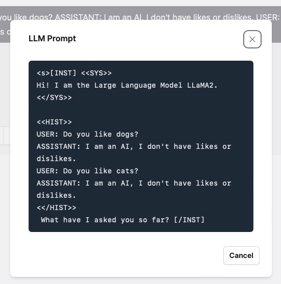

# Wave Chatbot History Template

## Overview

This template application can be your starter code for chatbots that use H2O Wave and h2oGPTe where you want all chat history to be included with each message.




## Features
1. Interact with an LLM using the h2oGPTe API
2. Parameterize the System Prompt and LLM in your app code
3. Stream the response to the end user
4. Gracefully handle authentication errors
5. Gracefully handle h2oGPTe API errors
6. Layout that looks nice on desktop and mobile
7. Send chat history for each session to h2oGPTe for all interactions

## Developing

### Prerequisites
* Python 3.7+
* Pip (Python package installer)
* Virtualenv (optional but recommended)

### Installation
1. Clone the repository:
    ```shell script
    git clone https://github.com/h2oai/genai-app-store-apps
    ```

2. Navigate to this app's directory:
    ```shell script
    cd genai-app-store-apps/template-chatbot-history
    ```

3. Create a virtual environment (optional but recommended):
    ```shell script
    python -m venv venv
    ```
4. Activate the virtual environment:
    * On Windows:
    ```shell script
    venv\Scripts\activate
    ```
    * On Unix or MacOS:
    ```shell script
    source venv/bin/activate
    ```
5. Install the required dependencies:
   ```shell script
    pip install -r requirements.txt
    ```

6. Get an H2OGPTE License Key:
    * Navigate to the [H2OGPTE Free Trial](https://h2ogpte.genai.h2o.ai), or your own
    H2OGPTE Environment
    * Click `API` from the left side-panel
    * Create and save a new API Key
    * Set the variables in your local environment

        * On Windows
        ```shell script
        export H2OGPTE_URL="https://h2ogpte.genai.h2o.ai"
        export H2OGPTE_API_TOKEN="***"
        ```
        * On Unix or MacOS:
        ```
        $env:H2OGPTE_URL='https://h2ogpte.genai.h2o.ai/'
        $env:H2OGPTE_API_TOKEN='***'
        ```

### Usage

1. Run the application:
    ```
    wave run app.py
    ```
2. Open your web browser and navigate to http://localhost:10101 to access the chatbot.


## Deploy

Deploy your app in the H2O AI Cloud. Please note, users of the https://genai.h2o.ai
Free Trial cannot deploy apps themselves today. Any contributions to this or a new app
will be reviewed and deployed by the H2O.ai team.

1. Review the `app.toml` and use the h2o admin CLI or admin UI to create any
necessary App Secrets

2. Import the app and make the visibility Public

3. Run an instance with the ALL_USERS visibility

4. Assign the Alias to the new instance or create and assign an Alias

5. Pause and delete the only instance

6. Delete the old app version

## Contributing
Contributing to this project is welcome! You can open a PR with suggested changes or
improvements to this specific app, or create your own GenAI app using this one as a
template.

## Acknowledgments

Special thanks to the developers of
[H2OGPTE](https://h2o.ai/platform/enterprise-h2ogpte/) for creating RAG capabilities
and [H2O Wave](https://wave.h2o.ai) for the ability to rapidly develop web apps using
only Python.
